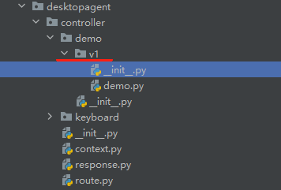
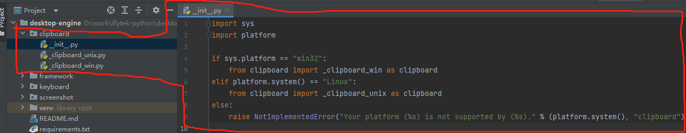
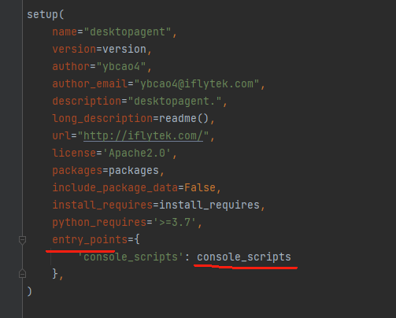
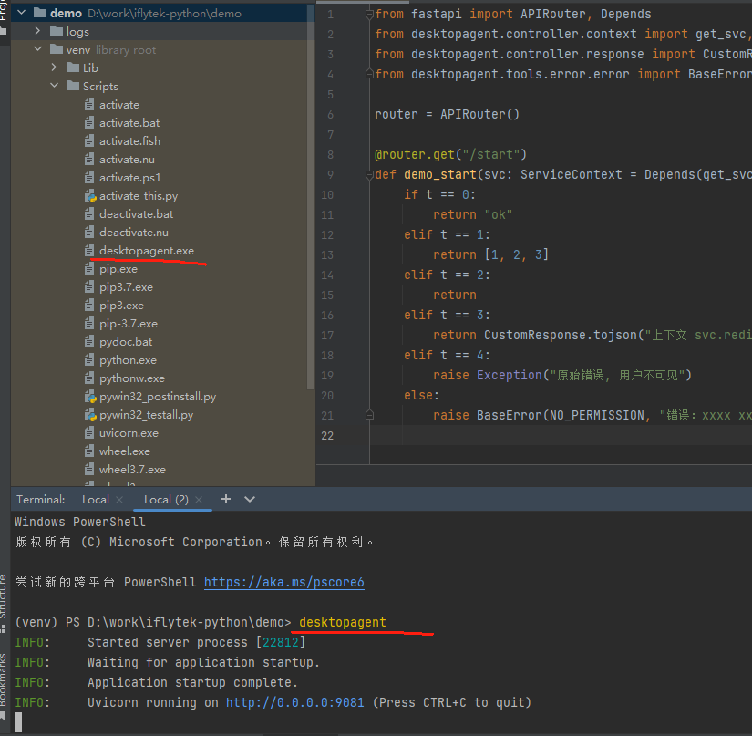
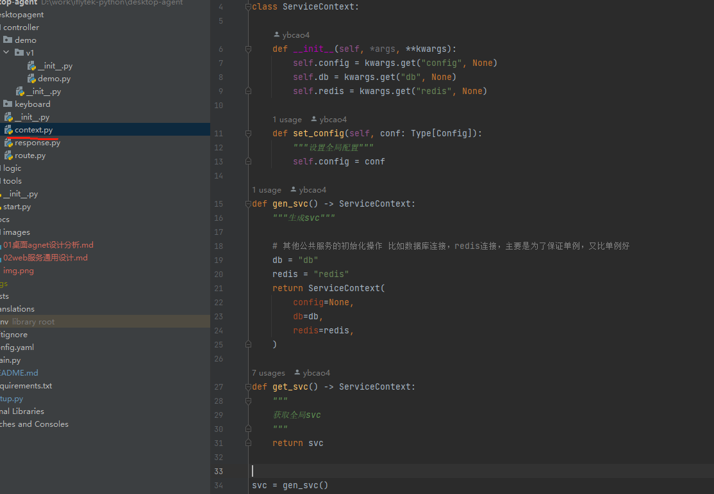

## 1. 目录总览

```txt
├── config.yaml                 # 应用配置
├── desktopagent
│     ├── controller            # 应用控制器，主要是处理http相关，无业务     
│     │     ├── context.py      # 应用控制器的上下文管理器, 所有控制器都能访问它 
│     │     ├── keyboard        # 应用模块
│     │     │     └── v1         
│     │     ├── response.py     # 应用控制器的统一返回值处理
│     │     └── route.py        # 应用路由
│     ├── logic                 # 核心，功能核心，剔除controller也能对外执行
│     │     └── clipboard
│     │           ├── _clipboard_unix.py    # linux
│     │           └── _clipboard_win.py     # win
│     ├── start.py              # http启动
│     └── tools
│         ├── config            # 应用配置读取，和转换成代码可读
│         ├── dial
│         ├── error             # 统一错误处理
│         ├── i18n              # 国际化处理
│         ├── logger            # 日志工具
│         └── utils
├── docs
├── logs
├── main.py
├── README.md
├── requirements.txt
├── setup.py
├── tests
└── translations                # 翻译目录
      ├── desktopagent.pot
      └── zh_CN
```

## 2. 通信方式

核心：通过将业务和通信拆离  
如何做: 通过引入一个通信中间层来解决

- logic: 核心，业务逻辑目录。没有任何约束
- controller: 通信中间层，将通信绑定到logic上, 该上面无任何业务逻辑

配合setup.py打包： comms_type【通信类型】 可以将业务区分

- 打包http的通信
- 打包通过直接调用的通信

## 3. 通信协议细节规范

核心：代码变更遵循，小版本兼容，大版本不兼容



## 4. 统一的工具类

- tools/config 对外配置统一
- tools/logger 对外日志统一
- tools/error  对外错误码统一
- tools/dial   对外请求统一
- tools/i18n   国际化

### 4.1 错误包设计

核心：将用户展示内容和日志展示内容隔离
应用场景：国际化，系统错误用户看不懂，错误地方和日志地方重合

```txt
from desktopagent.tools.i18n.i18n import _

class ErrorCode:
    """面向用户"""
    def __init__(self, code: str, message: str, httpcode: int = 200):
        self.code = code         # 错误码
        self.message = message   # 错误码对应的面向用户的错误提示
        self.httpcode = httpcode # 【可忽略】错误码扩展...

    def format(self, *args, **kwargs): # 有部分动态能力 比如 xxx[文件不存在]
        self.message = self.message.format(*args, **kwargs)


class BaseError(Exception):

    def __init__(self, code: ErrorCode, message: str):
        self.code = code        # 面向用户错误code
        self.message = message  # 面向日志展示错误


# 面向用户的错误码实例，主要是为了翻译, 所以90%国际化只需要翻译该目录即可
# 错误码 00【大模块code】 00【小模块code】 00【错误类型】，比如 用户登录密码错误 【用户大模块】【登录小模块】【密码错误】

CODE_OK: ErrorCode = ErrorCode("000000", "ok", 200)
CODE_INNER: ErrorCode = ErrorCode("100001", _("Internal Error"), 200)
NO_PERMISSION: ErrorCode = ErrorCode("101001", _("No Permission"), 403)
```

如何使用

```
raise Exception("原始错误, 用户不可见, 会被内部错误提示覆盖，所以尽量别报这个错误，报了也有兜底") 
raise BaseError(NO_PERMISSION, "错误：用户不可见错误打印, 用户只可见 NO_PERMISSION 里面的错误提示 {}".format(err))
```

如何捕获原始错误

见controller/response.py系统捕获

### 4.2 国际化推荐工具

- pot文件生成

```
# window没有该命令，通过在linux环境下执行

xgettext -o translations/screenshot.pot desktopagent/tools/error/error.py
```

- mo和po的文件生成

可以使用命令或者使用Poedit工具[建议]

https://poedit.net/


## 5. 非功能性考虑

### 5.1 统一国产化书写方式

- 按照模块来区分

适合差异不是特别大



配合setup.py打包： platform_type【平台类型】 可以将进行业务区分打包

- 按照项目来区分

适合比较大的差异，项目体积比较大

### 5.2 区分设计阶段和执行阶段

配合setup.py打包： runtime_type 【执行方式】 可以将进行业务区分打包

### 5.3 统一的启动器

使用setup.py实现统一的启动器




### 5.4 测试性代码

测试代码写入到 tests 目录下

核心：核心依赖注入，少用单例

